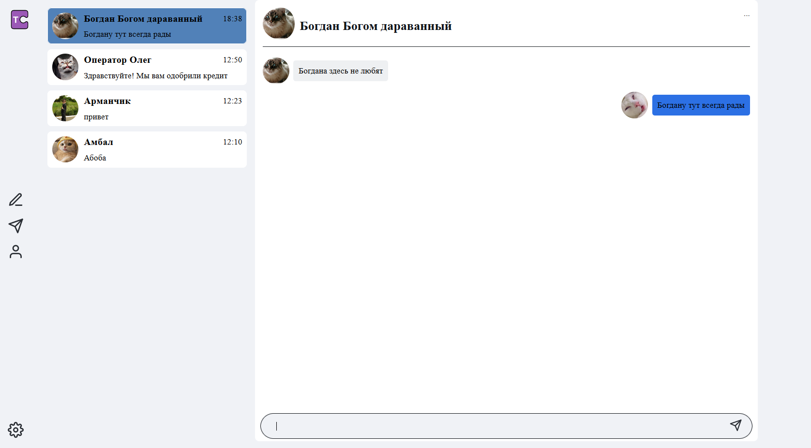

# messenger-ts
В процессе разработки
## Проект Мессенжер
Стек: React JS, TypeScript, React Toolkit, React Router Dom, Formik, Axios, SCSS, Webpack
## Запуск проекта
1) Склонируйте проект к себе на устройство
2) Перейдите в папку проекта при помощи терминала
3) Пропишите команду ```yarn``` или ```npm i```
4) Пропишите команду ```yarn start``` или ```npm run start```, чтобы запустить проект
## Preview




